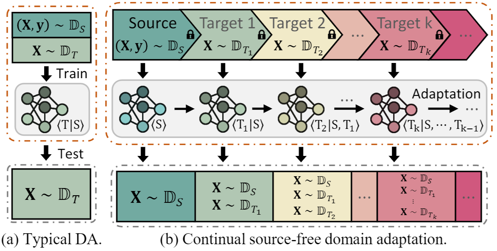








I'm a Ph.D. student at State Key Lab of CAD&CG, Zhejiang University , under the supervision of Prof. [Wei Chen](https://scholar.google.com/citations?user=EgQyYGUAAAAJ). I'm currently insterested in Trustworthy AI and LLMs.

<!-- I have a citation of <strong></strong>. -->

# 🔥 News
- *2024.05*: 🎉🎉 One paper gets accepted by ACL 2024 .

# 📝 Publications

ACL 2024

[Self-Distillation Bridges Distribution Gap in Language Model Fine-Tuning](https://arxiv.org/abs/2402.13669)

[PDF](https://arxiv.org/pdf/2402.13669) \|  \| [Poster](../files/sdft/sdft_poster.pdf) \| [Slide](../files/sdft/sdft_slide.pdf)

<!-- This is effective only if  exists. -->
<!--  -->

**Zhaorui Yang**, Tianyu Pang, Haozhe Feng, Han Wang, Wei Chen, Minfeng Zhu, Qian Liu

- In this work, we propose a novel fine-tuning approach to mitigate the catastrophic forgetting during the fine-tuning of language models.

arxiv:2304.06627

[CoSDA: Continual Source-Free Domain Adaptation](https://arxiv.org/abs/2304.06627)

[PDF](https://arxiv.org/pdf/2304.06627) \| 

Haozhe Feng\*, **Zhaorui Yang\***, Hesun Chen\*, Tianyu Pang, Chao Du, Minfeng Zhu, Wei Chen, Shuicheng Yan

- In this work, we investigate the mechanism of catastrophic forgetting of previous Source-Free Domain Adaptation (SFDA) approaches. Motivated by the findings, we propose CoSDA which outperforms SOTA approaches in continuous adaptation.

# 🎖 Honors and Awards
- *2022.12* China National Scholarship (Undergraduate).
- *2021.12* China National Scholarship (Undergraduate).

# 📖 Education
- *2023.09 - **Present***   Ph.D. student in Software Engineering at State Key Lab of CAD&CG, Zhejiang University .
- *2019.09 - 2023.06*   B.E. in Software Engineering, Xi'an Jiaotong University .

# 💻 Internships
None yet.

&copy; {{ site.time | date: "%Y" }} {{ site.title }}. Last Updated time: {{ site.time | date: "%Y-%m-%d %H:%M:%S" }}

<!-- 
&copy; {{ site.time | date: "%Y" }} {{ site.title }}. Last Updated time: {{ page.last_modified_at | date: "%Y-%m-%d %H:%M:%S"}}
 -->
