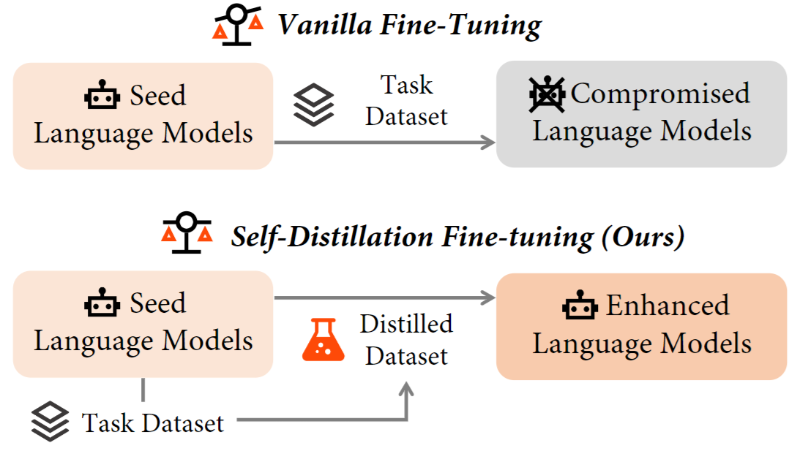








I'm a Ph.D. student at State Key Lab of CAD&CG, Zhejiang University , under the supervision of Prof. [Wei Chen](https://scholar.google.com/citations?user=EgQyYGUAAAAJ). I am also fortunate to work closely with [Qian Liu](https://siviltaram.github.io), [Tianyu Pang](https://p2333.github.io), [Haozhe Feng](https://fenghz.github.io) and [Minfeng Zhu](https://minfengzhu.github.io).

I'm currently insterested in Trustworthy AI and LLMs. 

<!-- I have a citation of <strong></strong>. -->

# 🔥 News
- *2024.05*: 🎉🎉 One paper gets accepted by ACL 2024 .

# 📝 Publications

ACL 2024

[Self-Distillation Bridges Distribution Gap in Language Model Fine-Tuning](https://aclanthology.org/2024.acl-long.58)

<a href="https://aclanthology.org/2024.acl-long.58.pdf" style="text-decoration: none; color: #a00" target="_blank"><i class="iconfont icon-filepdf" aria-hidden="true"></i> PDF</a> \|  \| <a href="../files/sdft/sdft_poster.pdf" style="text-decoration: none; color: #a00" target="_blank"><i class="iconfont icon-poster"></i> Poster</a> \| <a href="../files/sdft/sdft_slides.pdf" style="text-decoration: none; color: #a00" target="_blank"><i class="iconfont icon-filepowerpoint" aria-hidden="true"></i> Slides</a>

<!-- This is effective only if  exists. -->
<!--  -->

**Zhaorui Yang**, Tianyu Pang, Haozhe Feng, Han Wang, Wei Chen, Minfeng Zhu, Qian Liu

- Fine-tuning LLMs for specific tasks often encounters challenges in balancing performance and preserving general instruction-following abilities. In this work, we posit that the distribution gap between task datasets and the LLMs serves as the primary underlying cause. To address the problem, we introduce Self-Distillation Fine-Tuning (SDFT), a novel approach that bridges the distribution gap by guiding fine-tuning with a distilled dataset generated by the model itself to match its original distribution.

arxiv:2304.06627

[CoSDA: Continual Source-Free Domain Adaptation](https://arxiv.org/abs/2304.06627)

<a href="https://arxiv.org/pdf/2304.06627" style="text-decoration: none; color: #a00" target="_blank"><i class="iconfont icon-filepdf" aria-hidden="true"></i> PDF</a> \| 

Haozhe Feng\*, **Zhaorui Yang\***, Hesun Chen\*, Tianyu Pang, Chao Du, Minfeng Zhu, Wei Chen, Shuicheng Yan

- In this work, we investigate the mechanism of catastrophic forgetting of previous Source-Free Domain Adaptation (SFDA) approaches. We observe that there is a trade-off between adaptation gain and forgetting loss. Motivated by the findings, we propose CoSDA, which outperforms SOTA approaches in continuous adaptation.

# 🎖 Honors and Awards
- *2022.12* China National Scholarship (Undergraduate).
- *2021.12* China National Scholarship (Undergraduate).

# 📖 Education
- *2023.09 - **Present***   Ph.D. student in Software Engineering at State Key Lab of CAD&CG, Zhejiang University .
- *2019.09 - 2023.06*   B.E. in Software Engineering, Xi'an Jiaotong University .

# 💻 Internships
None yet.

&copy; {{ site.time | date: "%Y" }} {{ site.title }}. Last Modified on: {{ site.time | date: "%Y-%m-%d" }}

<!-- 
&copy; {{ site.time | date: "%Y" }} {{ site.title }}. Last Modified at: {{ page.last_modified_at | date: "%Y-%m-%d %H:%M:%S"}}
 -->
